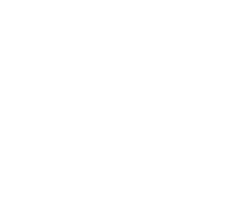

# R2 Drone Control

<p align="center">
  
</p>

Real-time drone detection and tracking dashboard with tactical and satellite map views.

## Features

- **Live Timeline** — Real-time event feed with severity filtering and drone details
- **Tactical View** — Canvas-based radar display with sensor coverage and drone trails
- **Satellite Map** — Google Maps integration with animated drone markers and movement tracking
- **Multi-Sensor Detection** — Simulated sensor network with patrol capabilities

## Tech Stack

- React 18 + TypeScript
- Vite
- React Router v6
- Google Maps JavaScript API
- Canvas 2D for tactical rendering

## Getting Started

```bash
# Install dependencies
npm install

# Start development server
npm run dev

# Build for production
npm run build
```

## Views

| View | Description |
|------|-------------|
| **Home** | Dashboard overview |
| **Live → Timeline** | Scrolling event feed with drone detection alerts |
| **Live → Tactical** | Radar-style map with real-time drone positions |
| **Live → Map** | Satellite view with Google Maps |
| **Reports** | Historical data analysis |

## Configuration

Google Maps API key is configured in `src/components/MapView.tsx`. For production use, replace with your own API key.

## Deployment

Automatically deploys to GitHub Pages on push to `main` branch.

---

<p align="center">
  <sub>Built with ⚡ by R2</sub>
</p>
